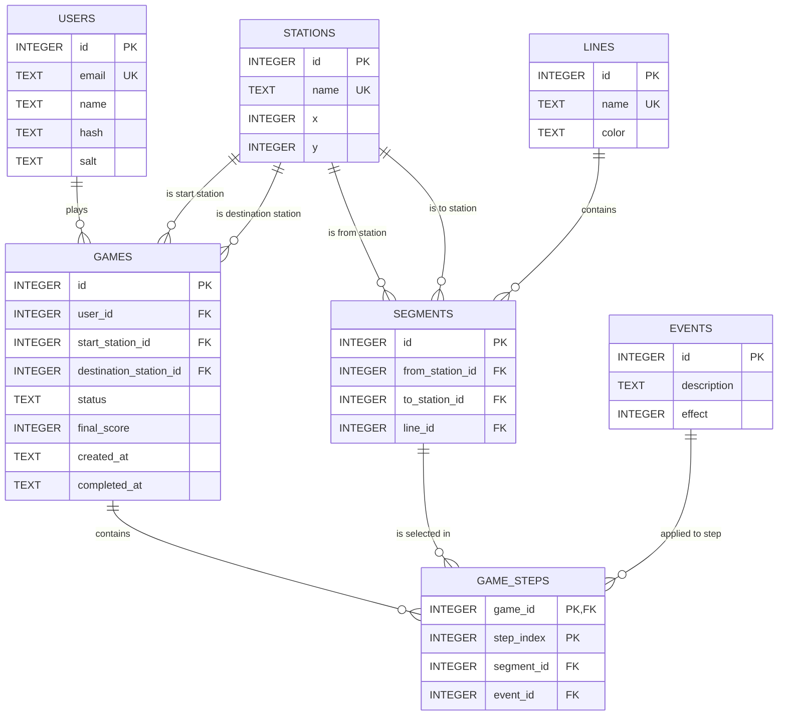

# Database Relational Model

This document describes the relational structure of the Last Race SQLite database.

GitHub renders the following Mermaid diagram directly in the Markdown viewer.

## ER Diagram

## Foreign Keys

| Table | Column | References | Meaning |
| --- | --- | --- | --- |
| `games` | `user_id` | `users.id` | Owner of the game. |
| `games` | `start_station_id` | `stations.id` | Randomly assigned start station. |
| `games` | `destination_station_id` | `stations.id` | Randomly assigned destination station. |
| `game_steps` | `game_id` | `games.id` | Game containing the planned/executed step. |
| `game_steps` | `segment_id` | `segments.id` | Directed segment selected for this step. |
| `game_steps` | `event_id` | `events.id` | Random event applied during execution. |
| `segments` | `from_station_id` | `stations.id` | Departure station of the directed segment. |
| `segments` | `to_station_id` | `stations.id` | Arrival station of the directed segment. |
| `segments` | `line_id` | `lines.id` | Line on which the directed segment exists. |

## Table Roles

- `users`: registered players. Passwords are stored as salted hashes.
- `lines`: fixed underground lines, each with a display color.
- `stations`: fixed underground stations, including coordinates for the UI map.
- `segments`: directed adjacent station pairs for a specific line. Each physical bidirectional connection is represented by two opposite segments.
- `events`: possible random events applied during route execution.
- `games`: one game session for one user, including start station, destination station, status and final score.
- `game_steps`: planned and executed route steps. The primary key is the pair `(game_id, step_index)`.

## Notes

- The metro network is static and stored server-side.
- A station belongs to a line when it appears in at least one segment of that line.
- Interchange stations are derived from stations appearing in segments belonging to more than one line.
- Route validation uses consecutive directed `segments` and allows line changes only at interchange stations.
- Every game starts from 20 coins by rule, so the initial value is not stored in the database.
- Intermediate coin totals are derived from the initial 20 coins and the events applied to executed steps.
- Scores and events are authoritative on the server; the client must not compute final results.
